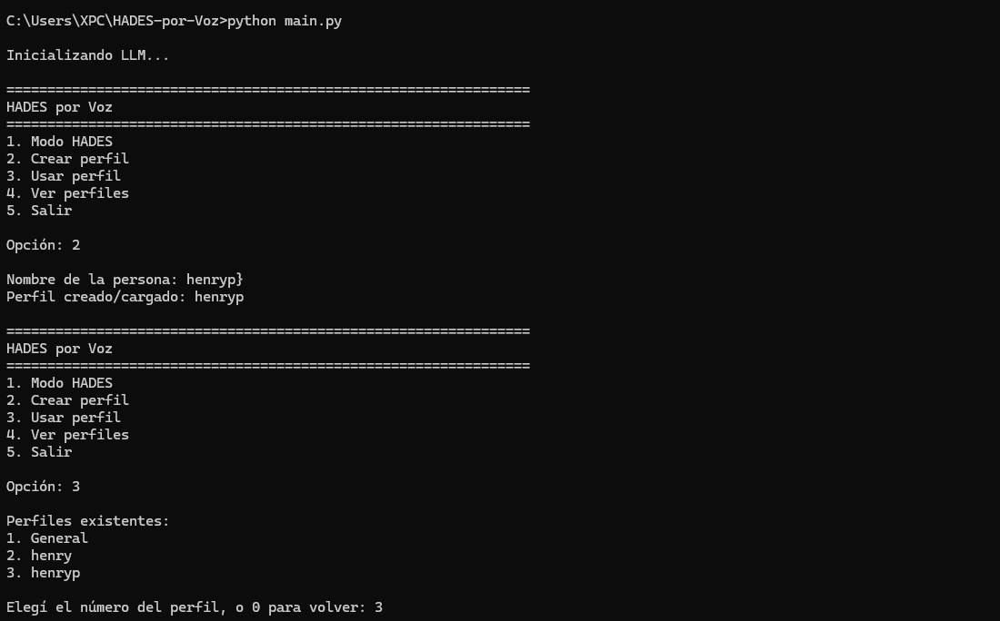
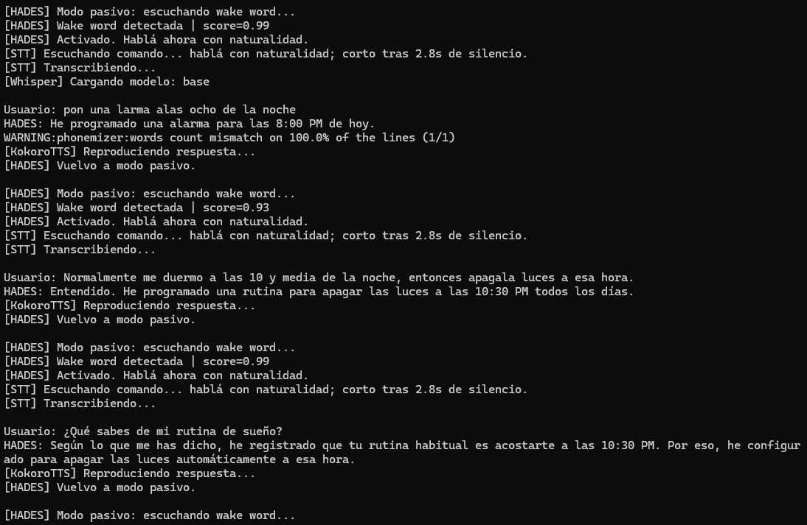
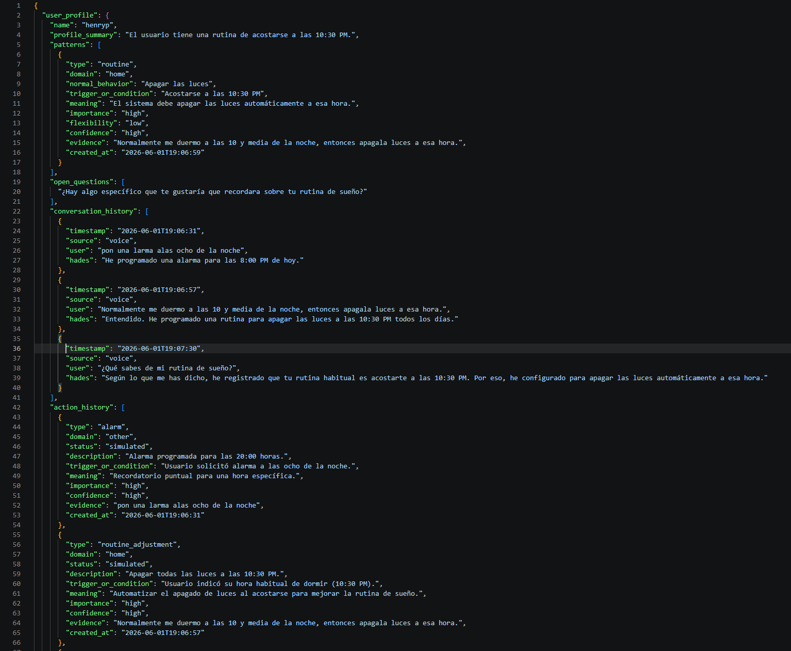

# Entregable 2: Avance de Agente e Investigación

**Proyecto:** HADES por Voz: Agente Virtual Conversacional con Memoria Contextual para el Hogar  
**Curso:** PF-3311 Agentes Virtuales Inteligentes  
**Profesor:** Alexander Barquero Elizondo  
**Estudiante:** Henry Campos Navarro - C21636  
**Universidad:** Universidad de Costa Rica, Escuela de Ciencias de la Computación e Informática  
**Sede:** Rodrigo Facio  
**Año:** 2026  

**Repositorio:** https://github.com/Henrycn04/HADES-por-Voz  
**Video de demostración:** https://youtu.be/-ljTmLNjrvM  

---

## a) Resumen de cambios desde el Entregable 1

En el Entregable 1, HADES por Voz fue propuesto como un agente virtual doméstico conversacional con memoria contextual, orientado a aprender rutinas, preferencias, prioridades y posibles excepciones del usuario a partir de interacciones simples. El problema central identificado fue que los asistentes conversacionales actuales suelen comportarse como sistemas reactivos basados en comandos, sin desarrollar una comprensión profunda de la persona, sus hábitos o sus cambios de comportamiento.

A partir de la retroalimentación recibida, se realizaron ajustes importantes en el enfoque del proyecto. Primero, se delimitó mejor el escenario de uso: HADES no se presenta únicamente como un chatbot que conversa sobre rutinas, sino como una Prueba de Concepto de asistente doméstico por voz capaz de recibir comandos, simular acciones del hogar y construir memoria contextual. Segundo, se clarificó la condición de comparación metodológica: la experiencia con HADES será contrastada con la experiencia previa reportada por los participantes con asistentes tradicionales como Alexa, Google Home o Siri. Tercero, se operacionalizaron mejor las variables de evaluación mediante métricas como naturalidad, utilidad percibida, precisión de patrones, continuidad conversacional, proactividad, invasividad y usabilidad general.

También se realizaron cambios técnicos relevantes. La arquitectura preliminar planteaba entrada por voz o texto, reconocimiento de voz, modelo conversacional, extracción de patrones, memoria contextual y respuesta por voz. En el estado actual, esa arquitectura ya fue implementada parcialmente con componentes concretos: Python, openWakeWord, Whisper, Ollama con Gemma 4 8B, Kokoro ONNX y memoria persistente en JSON. La decisión de pasar a una arquitectura local responde a la preocupación de privacidad del proyecto, ya que HADES maneja información personal como rutinas, horarios, acciones y preferencias.

---

## b) Estado actual del agente

HADES por Voz es actualmente un prototipo funcional de asistente doméstico conversacional con memoria contextual. El sistema se ejecuta de forma local en Python e integra activación por palabra clave, reconocimiento de voz, procesamiento conversacional mediante un modelo de lenguaje local, síntesis de voz, perfiles de usuario y almacenamiento persistente de memoria. Aunque todavía no controla dispositivos reales del hogar, puede simular acciones domésticas como alarmas, recordatorios, luces, música y ajustes de rutina, registrándolas en memoria para su posterior análisis.

El prototipo permite interactuar mediante voz y mantiene perfiles individuales. Cada perfil contiene historial conversacional, historial de acciones y patrones aprendidos. Esta separación es importante porque evita tratar todas las interacciones como memoria permanente: una alarma puntual se registra como acción, mientras que una frase como “normalmente me duermo a las diez y media” puede transformarse en un patrón recurrente. De esta forma, HADES empieza a diferenciar entre eventos temporales, comandos inmediatos y hábitos estables del usuario.

### Arquitectura técnica actual

```text
Usuario
  ↓
Wake word / Activación por palabra clave
  openWakeWord con “hey jarvis”
  ↓
Captura de audio
  Micrófono del sistema
  ↓
Reconocimiento de voz
  Whisper local
  ↓
Texto del usuario
  ↓
Agente conversacional
  Python + HADES Assistant
  ↓
Modelo de lenguaje local
  Ollama + Gemma 4 8B
  ↓
Consulta y actualización de memoria contextual
  Perfil activo + JSON persistente
  ↓
Registro de conversación, acciones y patrones
  conversation_history / action_history / patterns
  ↓
Síntesis de voz
  Kokoro ONNX
  ↓
Respuesta hablada al usuario
```

### Evidencia visual del prototipo

**Figura 1. Menú inicial del sistema.**  
Esta captura muestra el menú principal de HADES por Voz, con opciones como modo HADES, creación o selección de perfil y salida.



**Figura 2. Interacción demostrada en el video.**  
Esta captura muestra una interacción real con HADES durante la demostración, por ejemplo un comando doméstico simulado o una conversación donde el agente responde al usuario.



**Figura 3. Memoria JSON producida por la interacción.**  
Esta captura muestra la estructura de memoria generada por el sistema, especialmente `patterns`, `conversation_history` y `action_history`.



### Funcionalidades implementadas

- Ejecución local en Python.
- Interfaz inicial mediante menú en terminal.
- Activación por palabra clave con openWakeWord.
- Reconocimiento de voz local con Whisper.
- Procesamiento conversacional local con Ollama y Gemma 4 8B.
- Síntesis de voz local con Kokoro ONNX.
- Gestión de perfiles de usuario.
- Memoria persistente por perfil en JSON.
- Historial conversacional.
- Historial de acciones.
- Extracción de patrones a partir de evidencia conversacional.
- Simulación de acciones domésticas: alarmas, recordatorios, luces, música y ajustes de rutina.
- Separación entre acciones puntuales y patrones recurrentes.
- Recuperación de contexto desde memoria para interacciones posteriores.

### Funcionalidades pendientes o en refinamiento

- Integración con dispositivos reales del hogar.
- Mejora de la robustez ante errores de reconocimiento de voz.
- Refinamiento de la interpretación temporal de comandos ambiguos.
- Mayor validación automática de patrones aprendidos.
- Interfaz visual más amigable.
- Evaluación sistemática con participantes.
- Integración futura con sensores o módulos contextuales del hogar.

---

## c) Diseño metodológico del estudio

### Tipo de estudio

Se propone realizar un **estudio piloto exploratorio con compañeros del curso**, usando una muestra de **3 a 5 participantes**. Este tipo de estudio es adecuado para el estado actual del proyecto porque HADES se encuentra en fase de Prueba de Concepto. El objetivo no es validar un producto final ni realizar una evaluación longitudinal en hogares reales, sino obtener retroalimentación inicial sobre la interacción, la memoria contextual, la detección de patrones y la posible sensación de invasividad.

La elección de un piloto también responde a las condiciones del curso. Una evaluación con usuarios reales en un contexto doméstico completo requeriría procesos formales adicionales de aprobación ética. En cambio, un piloto académico con compañeros permite evaluar la claridad del sistema, la utilidad percibida y la coherencia de los escenarios sin recolectar datos sensibles innecesarios.

### Participantes

La muestra estará formada por **3 a 5 compañeros del curso** o personas del entorno académico con familiaridad básica con tecnología digital. Idealmente, los participantes tendrán alguna experiencia previa usando asistentes como Alexa, Google Home o Siri, ya que esa experiencia funcionará como baseline de comparación.

**Criterios de inclusión:**

- Ser mayor de edad.
- Poder interactuar en español con el sistema.
- Tener disponibilidad para una sesión breve de evaluación.
- Tener familiaridad básica con computadoras, asistentes de voz o sistemas digitales.

**Criterios de exclusión:**

- No aceptar el consentimiento informado.
- No desear que se registren respuestas o logs anonimizados.
- Requerir una evaluación clínica, terapéutica o de salud, ya que HADES no tiene ese propósito.

### Plan de reclutamiento

El reclutamiento será por conveniencia. Se invitará directamente a compañeros del curso o personas cercanas al entorno académico. Antes de iniciar, se explicará que HADES es un prototipo académico, que las acciones del hogar son simuladas y que los datos serán tratados de forma anónima mediante un ID de participante.

### Variable independiente

La variable independiente será el **uso de HADES por Voz**, un agente doméstico conversacional con memoria contextual y detección de patrones. Esta experiencia se comparará contra la experiencia previa reportada por los participantes con asistentes tradicionales como Alexa, Google Home o Siri, los cuales suelen operar frente a comandos directos.

### Variables dependientes

Las variables dependientes serán:

- Naturalidad de la interacción.
- Utilidad percibida.
- Precisión percibida en la detección de hábitos o patrones.
- Sensación de continuidad conversacional.
- Percepción de proactividad.
- Sensación de invasividad.
- Usabilidad general del sistema.

---

## d) Métricas

| Métrica | Qué mide | Relación con las RQs |
|---|---|---|
| Naturalidad de la interacción | Qué tan fluida, clara y conversacional se percibe la experiencia. | Responde a la RQ1 sobre naturalidad y utilidad de la memoria contextual. |
| Utilidad percibida | Si HADES parece útil para apoyar rutinas, organización o acciones domésticas. | Responde a la RQ1 y RQ3. |
| Precisión percibida de patrones | Si los patrones detectados representan correctamente hábitos o preferencias del participante. | Responde directamente a la RQ2. |
| Continuidad conversacional | Si el agente parece retomar información y mantener coherencia durante la interacción. | Responde a la RQ1 y RQ3. |
| Proactividad percibida | Si las sugerencias o interpretaciones del agente se sienten oportunas y relevantes. | Responde a la RQ3. |
| Invasividad percibida | Si el participante siente que el agente interpreta o recuerda información demasiado personal. | Responde a la RQ3. |
| Usabilidad general | Facilidad para comprender y usar el sistema. | Permite valorar si la PoC es usable además de funcional. |
| Éxito de tarea | Si el participante logra completar los escenarios propuestos. | Evalúa el funcionamiento práctico del prototipo. |
| Calidad de memoria contextual | Si las acciones y patrones se registran correctamente en JSON. | Responde a la RQ2 y valida técnicamente la PoC. |

---

## e) Instrumentos de recolección de datos

### 1. UEQ

Se utilizará el **User Experience Questionnaire (UEQ)** para evaluar la experiencia general del usuario. Este instrumento permite medir dimensiones como atractivo, claridad, eficiencia, confiabilidad, estimulación y novedad. En este estudio se aplicará al final de la sesión, después de que el participante haya interactuado con HADES y revisado los patrones detectados.

### 2. Cuestionario propio breve

Se aplicará un cuestionario propio con escala Likert de 1 a 5 para evaluar aspectos específicos de HADES que no son cubiertos directamente por el UEQ: memoria contextual, utilidad, naturalidad, proactividad, invasividad y comparación con asistentes tradicionales.

**Ítems sugeridos:**

1. La conversación con HADES se sintió natural.
2. HADES identificó información relevante sobre mis rutinas o hábitos.
3. Los patrones detectados por HADES fueron correctos.
4. Los patrones detectados por HADES fueron útiles.
5. Sentí que HADES mantenía continuidad durante la conversación.
6. La proactividad de HADES me pareció útil.
7. En algún momento sentí que HADES interpretó información demasiado personal.
8. Me sentiría cómodo usando un agente como HADES en un contexto doméstico.
9. Comparado con Alexa, Google Home o Siri, HADES se sintió menos dependiente de comandos directos.
10. Comparado con asistentes tradicionales, HADES se sintió más personalizado.

### 3. Logs del sistema y memoria JSON

Los logs del sistema y los archivos JSON de memoria se usarán como evidencia técnica del comportamiento del agente. Estos archivos permiten revisar si el sistema registró correctamente acciones, conversaciones y patrones. También permiten analizar si HADES diferenció adecuadamente entre acciones puntuales y rutinas recurrentes.

### 4. Revisión de patrones con el participante

Después de la interacción, el participante revisará los patrones detectados por HADES. Cada patrón podrá clasificarse como:

- Correcto.
- Parcialmente correcto.
- Incorrecto.
- Útil.
- No útil.
- Invasivo o demasiado personal.

Esta revisión permite evaluar la precisión percibida del agente sin asumir que todas las inferencias generadas por el sistema son correctas.

### 5. Entrevista semiestructurada breve

Al final de la sesión se realizará una entrevista breve para obtener retroalimentación cualitativa. Preguntas sugeridas:

- ¿Cómo describiría su experiencia conversando con HADES?
- ¿Qué patrón detectado le pareció más correcto o útil?
- ¿Hubo algún patrón que le pareciera incorrecto?
- ¿Hubo alguna interpretación que le pareciera invasiva o demasiado personal?
- ¿En qué se sintió diferente HADES respecto a Alexa, Google Home o Siri?
- ¿Qué tendría que mejorar HADES para que usted lo usara en un hogar real?

---

## f) Protocolos de interacción

### Escenario 1: Comando doméstico puntual

**Contexto:**  
El participante debe imaginar que está en su casa y necesita que el asistente configure una alarma puntual.

**Tarea:**  
Activar HADES y pedir una alarma.

**Frase sugerida:**  
“Hey Jarvis, poné una alarma a las siete.”

**Resultado esperado:**  
HADES debe confirmar la alarma de forma breve y registrarla en `action_history`. No debe convertir esta acción en un patrón permanente, porque el usuario no indicó recurrencia.

**Duración estimada:**  
2 minutos

**Qué evalúa:**  
Este escenario evalúa si el sistema puede entender un comando doméstico puntual, responder de forma funcional y registrar una acción sin generar memoria contextual innecesaria.

---

### Escenario 2: Rutina recurrente de sueño

**Contexto:**  
El participante debe imaginar que quiere que HADES conozca una rutina nocturna frecuente.

**Tarea:**  
Indicar una rutina relacionada con la hora de dormir y el control de luces.

**Frase sugerida:**  
“Hey Jarvis, normalmente me duermo a las diez y media, entonces apagá las luces a esa hora.”

**Resultado esperado:**  
HADES debe confirmar el ajuste simulado de luces y registrar un patrón asociado a la rutina de sueño. También puede registrar una acción relacionada con el control de luces.

**Duración estimada:**  
2 minutos

**Qué evalúa:**  
Este escenario evalúa si HADES distingue entre una acción doméstica y una rutina estable. También permite observar si la detección de patrones se basa en evidencia explícita de recurrencia.

---

### Escenario 3: Alarma recurrente para días laborales

**Contexto:**  
El participante debe imaginar que quiere configurar una alarma recurrente para días laborales.

**Tarea:**  
Indicar una rutina laboral y una alarma asociada.

**Frase sugerida:**  
“Hey Jarvis, despertame todos los días laborales a las siete porque trabajo a las nueve.”

**Resultado esperado:**  
HADES debe registrar la alarma como acción recurrente y extraer patrones relacionados con la hora de despertar y el inicio de la jornada laboral.

**Duración estimada:**  
2 minutos

**Qué evalúa:**  
Este escenario evalúa la capacidad del sistema para interpretar recurrencia, generar memoria contextual útil y registrar acciones simuladas relacionadas con rutinas.

---

### Escenario 4: Evento momentáneo que no debe volverse patrón

**Contexto:**  
El participante debe imaginar que tiene una situación puntual y no necesariamente recurrente.

**Tarea:**  
Dar un comando que incluye contexto momentáneo.

**Frase sugerida:**  
“Hey Jarvis, quiero ir a comer ahora en la noche, entonces poneme una alarma a las siete.”

**Resultado esperado:**  
HADES debe interpretar la alarma como una acción puntual. No debe guardar “quiero ir a comer ahora” como patrón permanente ni reutilizar memorias previas si el usuario no lo pidió.

**Duración estimada:**  
2 minutos

**Qué evalúa:**  
Este escenario evalúa si el sistema diferencia entre contexto momentáneo y memoria permanente, y si evita que información previa contamine la interpretación del comando actual.

---

## Gestión de datos y anonimización

Cada participante recibirá un ID anónimo, por ejemplo `P001`, `P002` o `P003`. Los logs y archivos JSON se guardarán usando ese ID y no el nombre legal del participante. Los consentimientos se almacenarán por separado de los datos de interacción. No se subirán logs reales, memorias personales ni datos sensibles al repositorio público de GitHub. Si se incluyen ejemplos en el repositorio, estos deberán ser ficticios o completamente anonimizados.

---

## Estado de la Prueba de Concepto

La PoC demuestra que la arquitectura propuesta es técnicamente viable. El sistema permite una interacción completa donde el usuario activa al asistente mediante wake word, el audio se transcribe con Whisper, el texto se procesa con un modelo local mediante Ollama/Gemma, se consulta y actualiza memoria contextual, y la respuesta se reproduce mediante Kokoro ONNX. Aunque las acciones domésticas todavía son simuladas, el flujo permite evaluar la integración real de los componentes y la lógica inicial de memoria contextual.

---

## Próximos pasos

- Aplicar el piloto con 3 a 5 compañeros del curso.
- Analizar resultados del UEQ y cuestionario propio.
- Revisar logs y patrones detectados.
- Refinar las reglas de extracción de patrones.
- Mejorar la robustez ante errores de STT.
- Reducir respuestas innecesariamente largas o preguntas no necesarias.
- Preparar una futura integración con dispositivos reales del hogar.

---

## Referencias

[1] R. van Kranenburg, “The Internet of Things. A Critique of Ambient Technology and the All-seeing Network of RFID,” 2007.  

[2] Ö. Özmen Garibay et al., “Six Human-Centered Artificial Intelligence Grand Challenges,” *International Journal of Human-Computer Interaction*, vol. 39, no. 6, pp. 1109-1130, 2023.  

[3] M. Allouch, A. Azaria, and R. Azoulay, “Conversational Agents: Goals, Technologies, Vision and Challenges,” *Sensors*, vol. 21, no. 24, 2021.  

[4] J. S. Park et al., “Generative Agents: Interactive Simulacra of Human Behavior,” 2023.  

[5] O. Oguntola and S. Simske, “Context-Aware Personalization: A Systems Engineering Framework,” *Information*, vol. 14, no. 11, 2023.  

[6] J. Cassell, “Embodied Conversational Agents,” *AI Magazine*, 2001.  

[7] T. W. Bickmore and R. W. Picard, “Establishing and Maintaining Long-Term Human-Computer Relationships,” *ACM Transactions on Computer-Human Interaction*, 2005.  

[8] N. Yee and J. N. Bailenson, “The Proteus Effect: The Effect of Transformed Self-Representation on Behavior,” *Human Communication Research*, 2007.  

[9] M. Schrepp, A. Hinderks, and J. Thomaschewski, “Applying the User Experience Questionnaire (UEQ) in Different Evaluation Scenarios,” 2014.  
